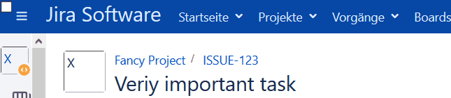
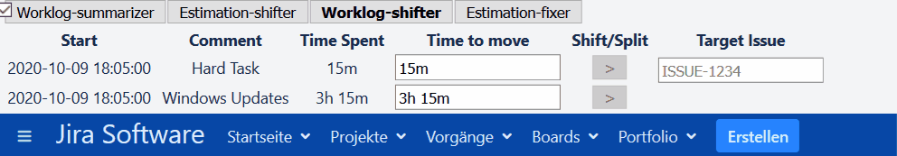

 

Jira Monkeys
============

Jira Monkeys is a tool to provide some additional functionality for and in jira which may be helpful in your daily work, regardless of whether you are a worker drone or the queen in your hive.

Of course it would be possible to create (or maybe buy) some jira plugins with the same or a similar ability, but this project is used es a playground for me.

Getting started
---------------
First you have to install the Tampermonkey to your browser. The Jira Monkeys are developed (and tested only) with chrome but may work with Firefox as well.
You can find details on how to install Tampermonkey at: [https://www.tampermonkey.net/](https://www.tampermonkey.net/)

Second you have to install the Jira Monkeys. If Tampermonkey is already installed a simple click [here](https://github.com/marmer/jira-monkeys/raw/master/dist/jira-monkeys.user.js) and an additional click on install should be enough. If this is not enough, you can install it manually. The just mentioned Tampermonkey documentation should be your friend.   

Usage
-----
If you've installed the Plugin already open up any of your issues. You should see an inconspicuous checkbox without any text on the top left corner of the menu bar. If you click it, you will see all the currently implemented features.

Features
--------
### Worklog-summarizer
Here you'll get a sortable summed up Overview of all the work logged to an issue.

 
 
### Estimation-shifter
You can easily parts of an estimation from one issue to another without to calculate the original and remaining estimate for both issues.

### Worklog-shifter
This feature allows you to either shift a part or a whole worklog to another issue or to split a worklog within an issue into multiple parts, depending on whether you use the same or a different issue key for shifting.

 

### Estimation-fixer
Jira is sometimes not able to adjust the remaining time when a worklog is edited, deleted or moved. With only one click at "Fix estimation" (if hav chosen the Estimatino-fixer in the menu before) this is getting fixed. Here is an example before and after a fix when bookings for 6 hours and 45 minutes have been removed.

 

UI
--
Just as much as needed. This tool only has to work for me and whoever wants to use it ... it's not about to be beautiful
